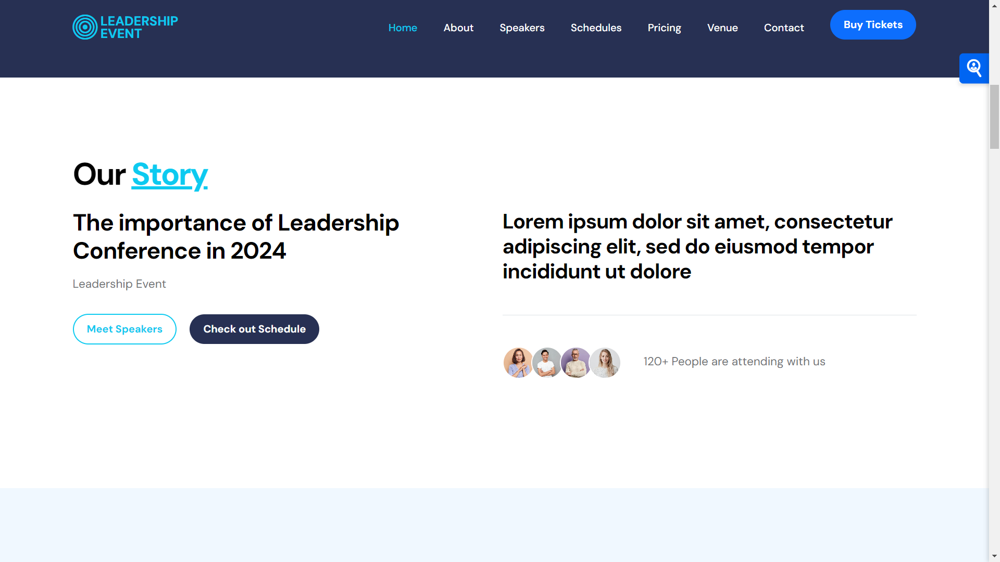

https://naimkatiman.github.io/Leadership-Event-Web/

# Leadership Event Website





## About the Project

The Leadership Event Website is a responsive, modern web application designed to promote and provide information about a leadership conference. This event is scheduled to take place from July 12 to 18, 2024, at the Putra World Trade Centre (PWTC) in Kuala Lumpur, Malaysia.

### Key Features

1. Responsive design for various screen sizes
2. Detailed event schedule with speaker information
3. Ticket pricing and purchase options
4. Venue information with Google Maps integration
5. Contact form for inquiries
6. Social media integration

## Technologies Used

- HTML5
- CSS3
- JavaScript
- Bootstrap 5
- jQuery
- Google Maps API

## Sections

1. **Home**: Introduction to the event with a video background
2. **About**: Brief description of the event's importance
3. **Speakers**: Profiles of key speakers
4. **Schedules**: Detailed event timetable
5. **Pricing**: Ticket options and prices
6. **Venue**: Location information with an embedded map
7. **Contact**: Form for attendees to get in touch

## How to Use

1. Clone the repository:
   ```
   git clone https://github.com/your-username/leadership-event-website.git
   ```
2. Open `index.html` in your web browser to view the website locally.

## Customization

To customize the website for your own event:

1. Update the content in `index.html` to reflect your event details.
2. Modify the CSS in `css/leadership-event.css` to change the styling.
3. Replace the images in the `images` folder with your own event photos.
4. Update the Google Maps embed code with your venue's location.

## Contributing

Contributions are welcome! Please feel free to submit a Pull Request.

## License

This project is open source and available under the [MIT License](LICENSE).

## Contact

For any inquiries, please reach out to us at hi@company.com or call 010-020-0340.

